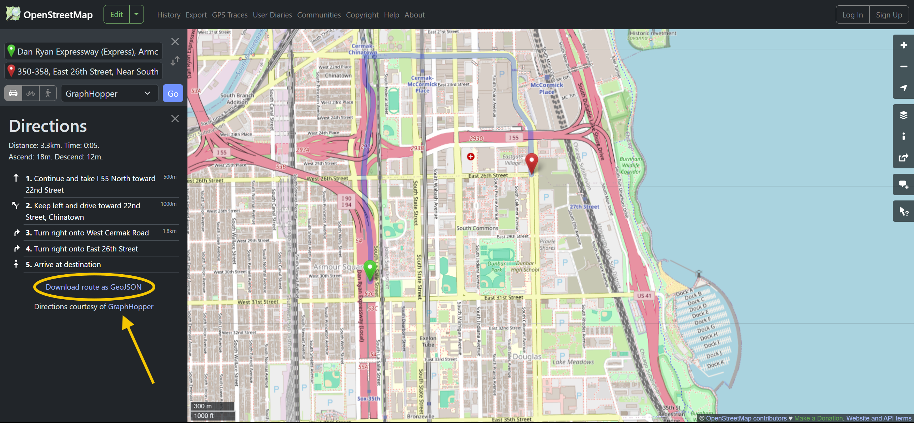
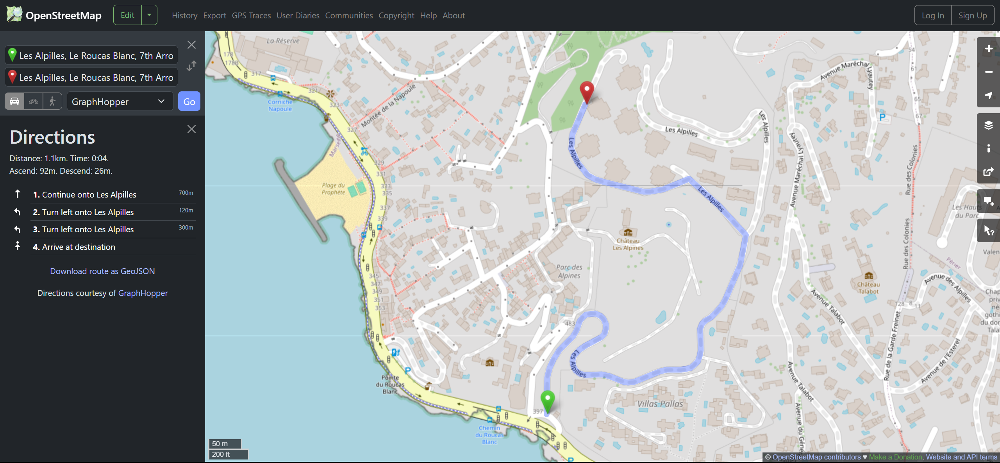
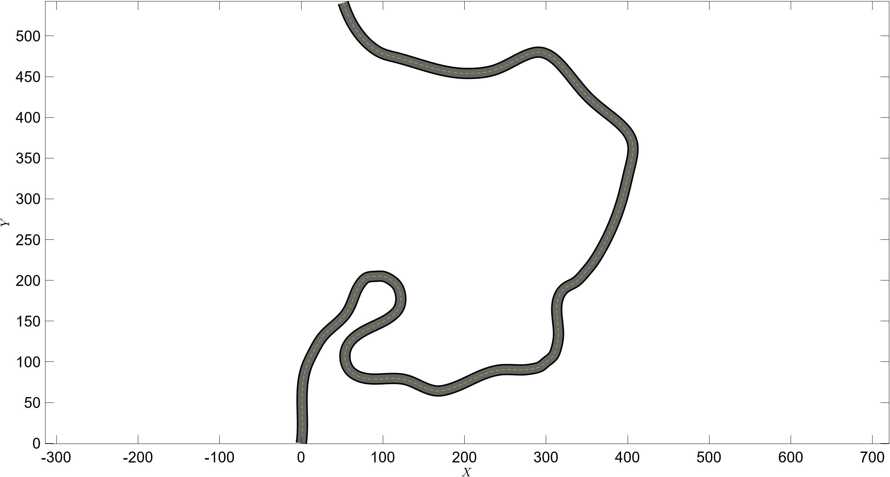

"# roadMaker Project" 
# roadMaker Project

## Overview
`roadMaker` is a MATLAB class designed to generate and analyze road trajectories for automated driving simulations. It supports two road types:
- **Symbolic**: Defines roads using mathematical functions (e.g., `y = sin(x)`).
- **Map**: Uses geographic data from JSON files (e.g., latitude/longitude coordinates).

This project includes the `roadMaker` class and example scripts demonstrating its use.

## Files
- **`roadMaker.m`**: The main class file implementing road generation and visualization.
- **`example_map.mlx`**: Example script for map-based roads using JSON data.
- **`example_symbolic.mlx`**: Example script for symbolic roads using a mathematical function.

## Prerequisites
- MATLAB (with Symbolic Math Toolbox for symbolic roads and Mapping Toolbox for map roads).
- Git installed for version control.
- A JSON file with route data (e.g., `route.json`) for map-based examples.

## Installation
1. Clone the repository:
   ```bash
   git clone https://github.com/alirezaEEpalm/roadMaker.git
   cd roadMaker```
   
## Usage
### Symbolic Road Example:
```MATLAB
syms x;
y = 15 * sin(0.05 * x) * exp(x/600);
road_xLength = 300; % meters
numberOfLines = 4;
lineWidth = 4; % meters
dx = 0.5; % meters

road = roadMaker('symbolic', numberOfLines, lineWidth, 1, dx, 'yes', road_xLength, x, y);
road.plotRoad();
```
### Prepare JSON Map Data

1. **Visit OpenStreetMap**  
   Go to [https://www.openstreetmap.org](https://www.openstreetmap.org)

2. **Navigate to your desired location**  
   Use the search bar or manually pan/zoom to your target area

3. **Create a route**  
   - Click the "Directions" button (top left, near search)
   - Set your starting point and destination
   - Alternative routes will appear in different colors

4. **Adjust the route** (if needed)  
   - Drag any point on the route path to modify it
   - Click on alternate route suggestions to switch

5. **Export the route**  
   - Click the "Share" button in the route panel
   - Select "Download as GPX" or "GeoJSON" option  
     

6. **Save the file**  
   - Name the file (e.g., `route.json`)
   - Place it in your project's `map data` folder
   - Ensure the filename matches your MATLAB code reference

### Map-Based Road Example:

```MATLAB
jsonData = jsondecode(fileread('map_data/route.json'));
road = roadMaker('map', 2, 6, 0, 0.5, 'no', jsonData);
road.plotRoad();
road.animateRoute(15, 100, 0.1);
```

## Results
Example : Marseille, France Route
Original map route from OpenStreetMap:


Processed road visualization using roadMaker:


The original geographic route converted to Cartesian coordinates

Generated lanes with proper width and curvature

Smooth transition between road segments